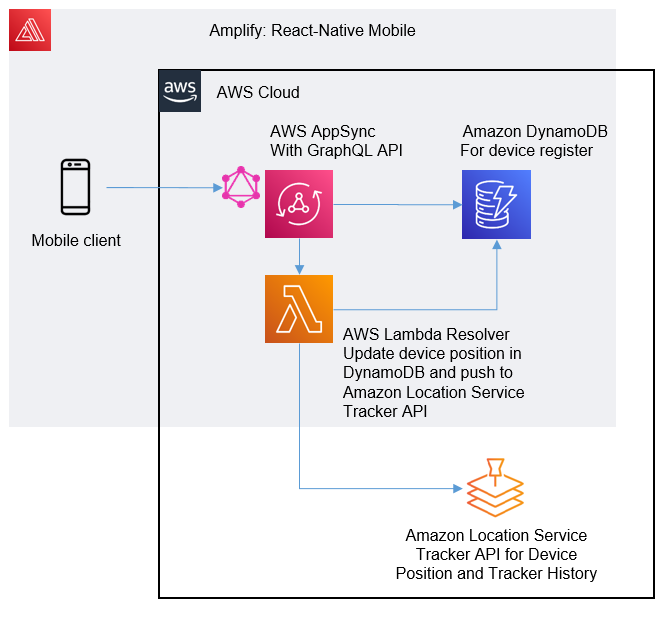

# React-Native Mobile Tracking App 

Demonstrates the basics of using AWS Amplify to integrate with Amazon Location Service tracker in a javascript react-natvie cross-platform mobile app.

The Expo framework has been used to scafold the cross-platform mobile app with react-native.

## Solution 

AWS Amplify is used to create a GraphQL API, using AWS AppSync and backed by Amazon DynamoDB, in order to register a mobile device with the solution and track the mobile location through Amazon Location Service.

AWS Amplify Add Function (AWS Lambda) is used as an AppSync data source to send the Location data to the Amazon Location Service tracker.

## Security

See [CONTRIBUTING](CONTRIBUTING.md#security-issue-notifications) for more information.

## License

This library is licensed under the MIT-0 License. See the LICENSE file.

